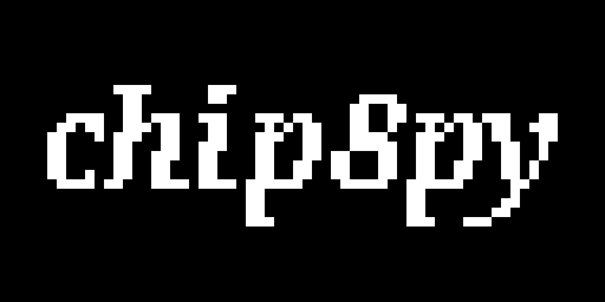

# chip8py


<div align="center">
</img>
<p><i>CHIP-8 interpreter written in Python</i></p>
</div>

## Contents

- [About](#about)
- [Installation](#installation)
- [Usage](#usage)
- [License](#license)

## About

CHIP-8 is an interpreted language developed during the 1970s.

chip8py is an interpreter that can run any program originally designed for the CHIP-8 platform.

## Installation

The project uses `pygame` to render the window:

```
python -m pip install pygame
```

Clone this repository into a folder:

```
git clone https://github.com/robertolaru/chip8py.git
```

## Usage

Running `python main.py --help` will provide the list of arguments the program supports:

```
usage: main.py [-h] [--cps CPS] [--fps FPS] [-c] [-m] program

positional arguments:
  program            Path to the program to load

optional arguments:
  -h, --help         show this help message and exit
  --cps CPS          Cycles per second. Default is 500 cps
  --fps FPS          Window rendering framerate. Default is 30 fps
  -c, --cpu-view     Enable visualization of CPU registers, stack, opcodes
  -m, --memory-view  Enable memory visualization. Also enables CPU visualization (like --cpu-view)
```

To run the program, you need to provide the path to the rom file (`program`) to load in the interpreter:

```
python main.py program
```

### Using the keyboard

Originally, user input on CHIP-8 was done through a 16-key hex keyboard.

The interpreter maps the original keys to the leftmost portion of QWERTY keyboards:

```
 1 2 3 C         \       1 2 3 4
 4 5 6 D     -----\       Q W E R
 7 8 9 E     -----/        A S D F
 A 0 B F         /          Z X C V

(original)              (interpreter)
```

## License

chip8py is licensed under the MIT license.
